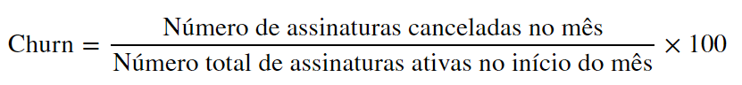

# Análise de Churn

A equipe de assinaturas tem como principal objetivo reduzir a taxa de
cancelamentos de assinantes, também conhecida como "Churn". No
entanto, mesmo com as melhorias de usabilidade da plataforma, é
evidente ao analisar os dados dos últimos meses que a taxa de Churn está
aumentando, o que indica a necessidade de ações mais efetivas para
reter os assinantes e aumentar a fidelidade dos clientes.

O objetivo dessa análise é investigar os possíveis motivos que estão
culminando no cancelamento das assinaturas, para no final **gerar insights
acionáveis**, visando reverter e amenizar a situação.

Os seguintes links retornam diretamente para:

[Notebook da Análise](Churn%20Petlove.ipynb)\
[Apresentação da Análise](Apresentação%20%20Churn.pdf)
